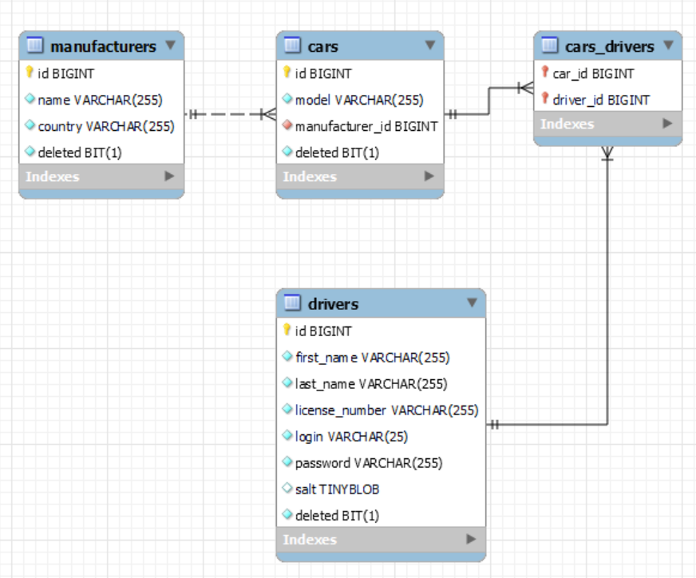

## TAXI-SERVICE

#General info 
Taxi-service is a simple application for a company providing taxi service. It can assist to organize 
the list of available cars and drivers assigned to them using web browser and database management 
system.

#Technologies
A list of technologies used within the project:
  * HTML
  * JDBC
  * JDK 11  
  * JSP 
  * JSTL 
  * SQL
  * Apache Maven v.3.6.3
  * Library javax.servlet v. 4.0.1
  * MySQL 8.0  
  * Tomcat v.9.0.46
  * Apache Log4j2  
  * IntelliJ IDEA 2021.1.1 (Ultimate Edition)
  * Git v2.30.1
  * OS Windows 8.1 

#Installation
Application can be launched on a computer that has JRE (JDK 11), IDE, Maven, Tomcat and MySQL Workbench 
installed.

To deploy the project on your computer using IntelliJ IDEA:

1.Create new project by cloning this repository: `File`->`New`->`Project from version control` and
  insert URL _https://github.com/fotomassimo/taxi-service.git_.
   
2.Setup web server: `Run`->`Edit Configurations`, click `+` (or press `Alt+Insert`on Windows) to 
  `Add new Configurtion`, type `tomcat` and select `Tomcat Server`->`Local`. In the following menu
  insert _http://localhost:8080/_ for `URL`, 8080 for `Http port`, v. 11 for `JRE` and press `Fix`.
  In the next menu `Select artifact to deploy`->`taxi-service:war exploded` and insert only `/` 
  for `Application context`, press`Ok`.
   
3.Setup database: in `MySQL Workbench` create and open new connection with your credentials or use 
  the existing one, open file `src/main/resources/init_db.sql` from the folder of this project 
  on your computer `File`->`Open SQL script` (or press `Ctrl+Shift+O` on Windows) and execute this
  script `Query`->`Execute (All or Selection)` (or press `Ctrl+Shift+Enter` on Windows).

4.Setup database connection properties: Open file `src/main/resources/mysql.properties` in this 
  project using IDE and set values `user`, `password` and localhost port value according to the
  credentials from your MySQL connection.

5.Setup logger log4j2: Open file `src/main/resources/log4j2.xml` in this project using IDE and set 
  value `<Property name="logdir">` as an absolute path of this project directory on your computer 
  (i.e. `C:\Users\MyUser\IdeaProjects\taxi-service`) or any custom directory, where you want to locate 
  log files. This logger is used to keep records of user's unsuccessful authentication attempts.

6.Deploy the project on the web server using IDE: `Run`->`Run`(or press `Shift+F10` on Windows).
   
To use another DBMS that supports SQL script you have to create new file in `src/main/resources/` 
folder with the same structure and extension as `mysql.properties` and set values in compliance with 
the DBMS vendor official documentation. Then change value of the constant variable _PROPERTIES_FILE_NAME_ 
in the file `src/main/java/taxi/util/ConnectionUtil.java` to the name of your custom file.

#Usage
Your web browser after successful deployment will automatically open the starting page of the 
application where yor have to register a new driver in order to login. Then log in as a driver 
to use the main menu with different options:
  * Display all registered drivers with an option to delete a driver profile
  * Display all registered cars with options to add a driver profile to a certain car or delete 
    a car profile
  * Display all registered car manufacturers with an option to delete a manufacturer profile
  * Register a new driver 
  * Register a new car. In order to create a new car profile you must have a registered 
    manufacturer id
  * Register a new manufacturer
  * Add a driver profile to a certain car. You must have a registered car id and a driver id 
  * Display all registered cars assigned to the driver currently logged in.

The diagram below describes the key classes of objects that we can create and manage in this 
application, their parameters and relations between them. 

